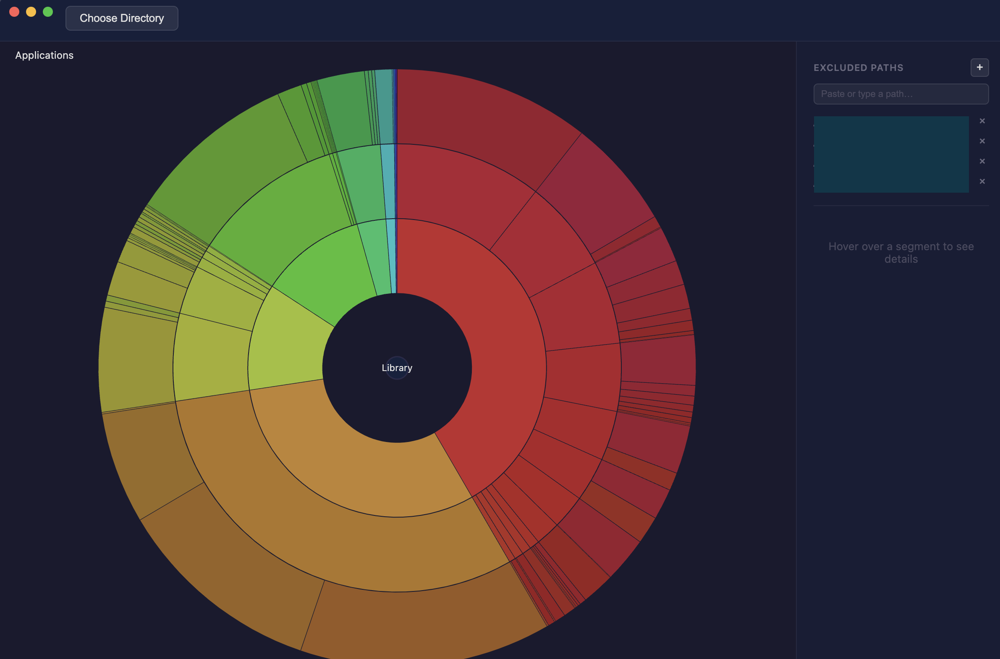

<p align="center">
  
</p>

# Disk Viz

A macOS desktop app for visualizing disk usage as an interactive sunburst chart. Built with Electron and D3.js.



## Install

Download the latest `.dmg` from [Releases](https://github.com/kzonov/disk-viz/releases), open it, and drag **Disk Viz** to Applications.

The app is ad-hoc signed but not notarized with Apple, so the first launch is blocked by Gatekeeper. Two ways around it:

- **GUI**: double-click the app, dismiss the warning, then go to **System Settings → Privacy & Security**, scroll to *"Disk Viz was blocked…"*, and click **Open Anyway**.
- **Terminal**: `xattr -cr /Applications/Disk\ Viz.app`

Either works; you only need to do it once.

## Development

```bash
npm install
npm start
```

To build the `.app` / `.dmg`:

```bash
npm run build
# Output: dist/Disk Viz-*.dmg
```

## Usage

Click **Choose Directory** and pick a folder to scan.

## Features

- Interactive sunburst chart — click segments to drill down, click center to go back
- Breadcrumb navigation
- Exclude paths from the scan
- Background scanning with progress indicator

## Contributing

Bug reports, feature suggestions, and PRs are welcome.

- **Issues**: please include macOS version, what you tried, and the behavior you saw vs. expected. Scanner issues benefit from the directory layout that triggered them.
- **Pull requests**: fork the repo, branch off `main`, and open a PR. Keep changes focused — one topic per PR. Run `npm test` before submitting.
- **Dev setup**: see [Development](#development) above.

No formal style guide — match the existing code (plain JS, no TypeScript, no linter) and keep dependencies minimal.

## Changelog

See [CHANGELOG.md](CHANGELOG.md).

## License

MIT — see [LICENSE](LICENSE).
